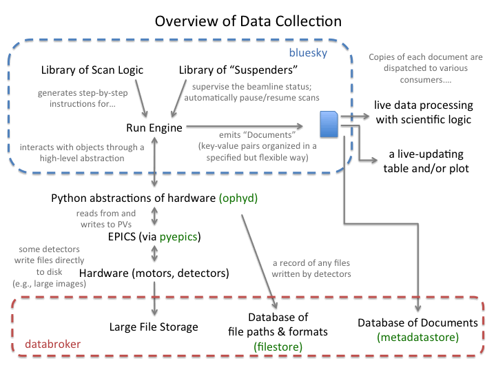

.. NSLS-II arch documentation master file, created by
   sphinx-quickstart on Sun Jan 18 10:00:09 2015.
   You can adapt this file completely to your liking, but it should at least
   contain the root `toctree` directive.

NSLS-II Software Documentation
******************************

The NSLS-II software toolchain is a set of cooperative software components
for scientific data acquisition, management, and analysis. It aims to address
the entire process, from experiment specification to the composition of
publication-quality plots.

Design Goals
============

* Provide an integrated toolchain for data collection and analysis.
* Support **streaming** data analysis, variously called "in-line" or "live".
* Support **prompt** data analysis: immediate, semi-automated data analysis
  that can inform decisions made during an experiment.
* Capture **metadata** to record a detailed snapshot of the hardware and --- as
  much as possible --- represent the user intention, the meaning of the
  measurements.
* Make datasets **searchable** with rich queries on metadata and data.
* Use **existing, open-source technologies and languages**; avoid inventing a
  domain-specific language.
* Leverage tools from the **open scientific software** community and in
  particular the **scientific Python** community, a mature and widely-used
  ecosystem of scientific code used in trusted, critical applications in
  research and beyond.
* Establish **clear, consistent interfaces** (meaning inputs and outputs,
  APIs) that allow project components to be used independently, extended, and
  interfaced with other, outside projects.
* Adhere to good software practices, especially code review and
  automated testing, with the goal of enabling **large-scale collaboration**
  while maintaining **stability and robustness**.

Project Status & Roadmap
========================

The software is supporting data acquisition at ten beamlines at NSLS-II, and it
has been successfully tested at other facilities.

The acquisition software stack (ophyd, bluesky) has stabilized. During two
years of testing with real hardware and real users, the software underwent
several iterations of re-design. Now, new and unforeseen applications are
fitting well into the framework, validating its assumptions and optimizations.
Recent development effort has gone primarily into documentation and
community-building.  The
`bluesky documentation <https://nsls-ii.github.io/bluesky>`_ in particular has
become polished and comprehensive. There are
some early examples of feeding prompt analysis back into the experiment control
logic.

Going into the Spring 2017 cycle, the focus is shifting to data access. This
includes streamlining the user interface to saved data (databroker) and
optimizing the data storage backend with performance and portability in mind.
Additionally, work is ongoing to capture intermediate analysis results with
associated provenance.

Building on top of this data retrieval software, we will write cross-beamline
multimodal analysis tools.

Detailed plans for each project are managed and discussed in the open on
`GitHub <https://github.com/NSLS-II/>`_, where the user community is invited to
observe, comment, and contribute.

Software Packages
=================

The following software packages work together to handle different aspects of
data collection and analysis. They interoperate by sharing a common
:ref:`event-based model <architecture>`. Each package has its own detailed
documentation, linked below.

* Data Collection Packages
    * `bluesky <http://nsls-ii.github.io/bluesky>`_ -- a framework for specifying and executing experiments
    * `ophyd <http://nsls-ii.github.io/ophyd>`_ -- a collection of Python objects that represent hardware, providing a common high-level interface
* Data Access Packages
    * High-level Data Access
        * `databroker <http://nsls-ii.github.io/databroker>`_ -- a simple interface that pulls together data from all sources
        * `amostra <https://nsls-ii.github.io/amostra>`_ -- for managing metadata related to experiment samples
    * Low-Level Data Storage and Access
        * metadataclient (preferred), metadatastore (deprecated)
        * filestore
* Data Munging Packages
    * `datamuxer <http://nsls-ii.github.io/datamuxer>`_ -- a "de-multiplexer" for alignment and basic processing of asynchronous, event-based data
* Data Export Packages
    * `suitcase <http://nsls-ii.github.io/suitcase>`_ -- a simple proof-of-concept, exporting experiment data and metadata from a database to a stand-alone file
* Scientific Data Processing Packages
    * the built-in subscriptions in `bluesky <http://nsls-ii.github.io/bluesky>`_
    * `scikit-beam <scikit-beam.github.io/scikit-beam>`_
    * Beamline-specific \*tools repositories:
        * `csxtools <https://nsls-ii-csx.github.io/csxtools/>`_
        * `chxtools <https://github.com/NSLS-II-CHX/chxtools>`_ (undocumented)
        * `hxntools <https://github.com/NSLS-II-HXN/hxntools>`_ (undocumented)

.. toctree::
   :hidden:
   :maxdepth: 2

   architecture-overview
   tutorials
   collection-quick-start
   analysis-quick-start
   examples/index
   sandbox
   fresh-installation
   resources
   technologies

.. toctree::
   :hidden:
   :caption: Data Collection

   bluesky <https://nsls-ii.github.io/bluesky>
   ophyd <https://nsls-ii.github.io/ophyd>

.. toctree::
   :hidden:
   :caption: Data Access

   databroker <https://nsls-ii.github.io/databroker>
   amostra <https://nsls-ii.github.io/amostra>

.. toctree::
   :hidden:
   :caption: Data Munging

   datamuxer <https://nsls-ii.github.io/datamuxer>

.. toctree::
   :hidden:
   :caption: Data Export

   suitcase <https://nsls-ii.github.io/suitcase>

.. toctree::
   :hidden:
   :caption: GitHub Links

   NSLS-II repositories <https://github.com/NSLS-II/>
   Wish List <https://github.com/NSLS-II/wishlist/issues>
   Bug Reports <https://github.com/NSLS-II/Bug-Reports/issues>
